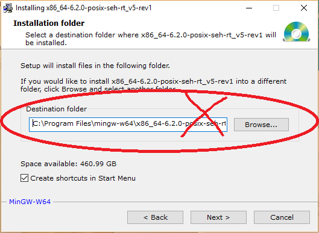

# Configuração do ambiente Matlab para uso do framework MatConvNet (deep learning)

Pré-requisitos: Você precisa de um compilador C configurado no sistema operacional para compilar o framework. Caso não tenha, vá direto ao passo 6.

Passo 1: Faça o download da última versão do MatConvNet no site: http://www.vlfeat.org/matconvnet/

Passo 2: Abra o Matlab com privilégios de administrador (Opção disponível ao clicar com botão direito do mouse no link do matlab)

Passo 3: Digite o comando: cd <diretoriodapastaMatConvNet> ou use o navegador de diretórios do Matlab para escolher a pasta onde o framework foi descompactado.

Passo 4: Digite o comando: 

	addpath matlab

Com isso você adicionará todas as funções do framework no Matlab. 

Passo 5: Digite o comando: 

	vl_compilenn 

Se executou corretamente. Parabéns. 

Possível erro: Se você não configurou previamente a compilação de código C no Matlab, você receberá a mensagem de erro abaixo, senão pule para o passo :

"Error using vl_compilenn>check_clpath (line 585)
Mex is not configured.Run "mex -setup" to configure your compiler. See http://www.mathworks.com/support/compilers for supported compilers for your platform."

Passo 6: Digite o comando: mex -setup
Se você receber a mensagem
"Error using mex
No supported compiler or SDK was found. You can install the freely available MinGW-w64 C/C++ compiler; see Install MinGW-w64 Compiler. For more options, visit http://www.mathworks.com/support/compilers/R2016b/win64.html." 

Significa que você não tem o compilador da linguage C configurado em seu sistema operacional.

Passo 7: Você pode instalar manualmente o MinGW-64 ou o Cygwin. Para usuários de Windows 10, instale o Microsoft Visual C++ 2015 Professional. A versão "Microsoft Visual C++ 2015 Redistributable" NÃO CONTÉM os pacotes necessários. Se você optar pelo Microft Visual C++ 2015, faça a instalação (que demanda tempo) e pule para o passo 10.

Passo 8: Instalando o minGW-64. Acesse o site https://sourceforge.net/projects/mingw-w64/files/ e faça o download do mingw-w64. A VERSÃO 32 bits NÃO FUNCIONARÁ para compilar o framework no Matlab. 

IMPORTANTE: Na tela de opções de instalação, escolha a versão de 64 bits conforme tela abaixo e altere o diretório de instalação de modo a não conter espaço nos nomes das pastas. Coloque algum caminho fácil, como por exemplo, C:\mingw-w64\ 

 
Passo 9: Reinicie o sistema operacional. Abra o terminal do DOS e verifique, digite o comando "gcc" e verifique se o compilador foi reconhecido. Caso não, verifique se o diretório foi adicionado as variáveis de ambiente.
Caso não esteja, você precisa adicionar manualmente o diretório de instalação do minGW (no meu caso ele está no diretório C:\mingw64\mingw64\bin\ " na variável de ambiente PATH

Passo 10: No Matlab, digite o comando abaixo para adicionar a variável de sessão no matlab.

    setenv('MW_MINGW64_LOC','C:\\mingw-w64\\mingw64\\')

Diferentemente da variável de ambiente no windows, não coloque o diretório \BIN no comando acima, senão o MEX não encontrará o compilador GCC.exe.

Passo 11: Digite novamente o comando no matlab: 
	
	mex -setup
	
Você deverá receber a mensagem abaixo de que o MEX encontrou o compilador C.

Passo 12: Verifique se voçê tem uma GPU em seu computador, caso sim execute o comando abaixo para instalar o framework:
	
	vl_compilenn()
	
Caso não tenha GPU e deseja usar apenas a CPU digite o comando abaixo
	
	vl_compilenn('EnableGpu',false)

Você deverá receber a mensagem de "MEX completed successfully."

Passo 13: Instale com o comando:

	vl_setupnn
